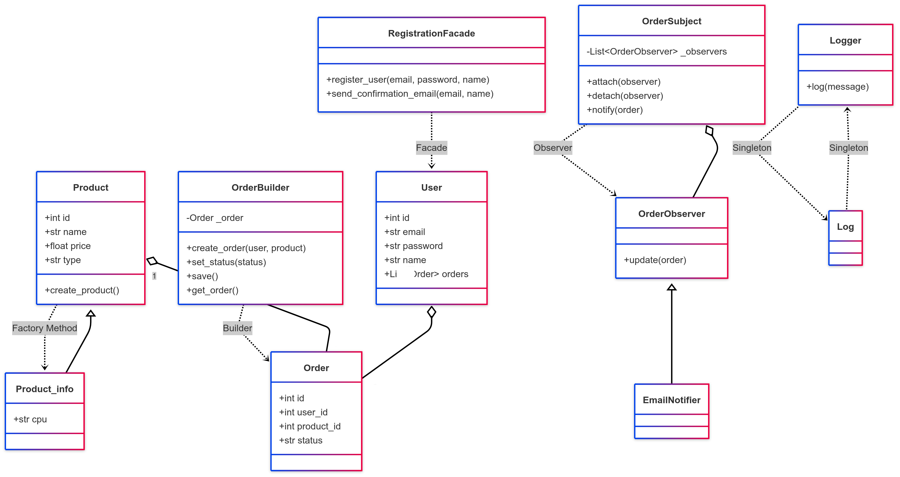
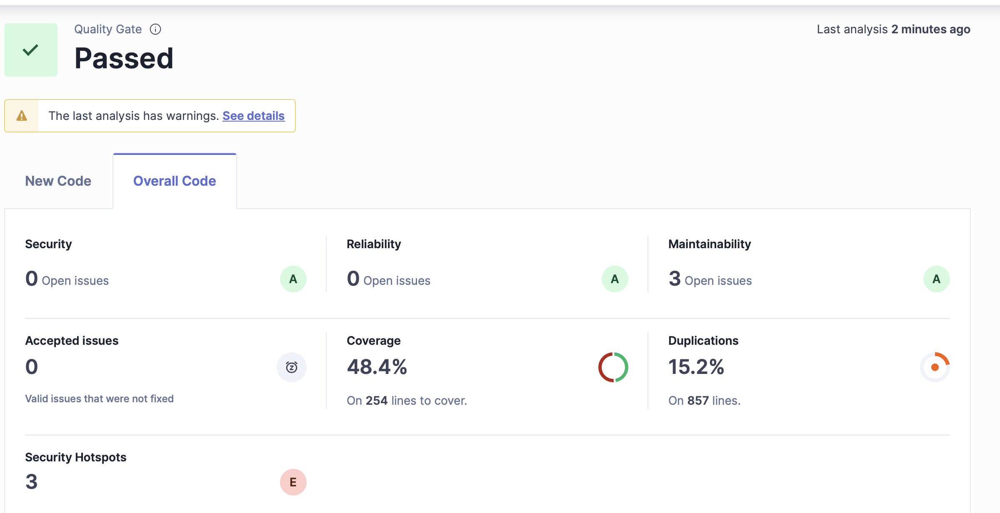

# Refactoring Project: Tech Store

## Опис
Веб-додаток для продажу технічних товарів (телефони, комп'ютери) з використанням FastAPI, Jinja2, SQLAlchemy (SQLite), патернів проектування (Builder, Facade, MVC, Singleton, Factory Method, Observer).

---

## Архітектура та патерни

### MVC (Model-View-Controller)
**Мета:** Розділення відповідальностей для зручності підтримки, масштабування та тестування.
- **Models (`app/models/`)**
  - SQLAlchemy-моделі: `User`, `Product` (та нащадки `Phone`, `Computer`), `Order`.
  - Відповідають за структуру даних, зв'язки, роботу з БД.
- **Views (`app/views/`)**
  - Jinja2-шаблони: `index.html`, `register.html`, `login.html`, `products.html`, `order_success.html`.
  - Відповідають за відображення даних користувачу (HTML).
- **Controllers (`app/controllers/`)**
  - FastAPI endpoints: логіка обробки HTTP-запитів, роутінг, робота з моделями та шаблонами.

### Builder
**Мета:** Поетапне створення складних об'єктів (замовлення), щоб уникнути складних конструкторів.
- **OrderBuilder (`app/builder/`)**
  - Дозволяє створювати замовлення крок за кроком (user, product, статус).
  - Можна легко додати нові кроки (наприклад, знижку, доставку).
  - **Приклад:**
    ```python
    builder = OrderBuilder()
    order = builder.create_order(user, product).set_status('paid').save()
    ```

### Facade
**Мета:** Спрощення взаємодії з підсистемами, приховування складної логіки за простим інтерфейсом.
- **RegistrationFacade (`app/facade/`)**
  - Одна точка входу для реєстрації користувача:
    1. Перевірка email
    2. Валідація даних
    3. Збереження у БД
    4. Надсилання email-підтвердження
  - **Приклад:**
    ```python
    success, msg = RegistrationFacade.register_user(email, password, name)
    ```

### Singleton
**Мета:** Гарантувати, що у системі є лише один екземпляр певного класу.
- **Logger (`app/utils/`)**
  - Єдиний логер для всієї системи.
  - Використовується для логування подій (наприклад, зміна статусу замовлення).
  - **Приклад:**
    ```python
    Logger().log("Order created!")
    ```

### Factory Method
**Мета:** Дати єдиний інтерфейс для створення об'єктів різних підкласів.
- **Product.create_product (`app/models/`)**
  - Створює або `Phone`, або `Computer` залежно від типу.
  - Дозволяє легко додати нові типи продуктів без зміни клієнтського коду.
  - **Приклад:**
    ```python
    phone = Product.create_product('phone', name='iPhone', price=1000, sim_count=2)
    computer = Product.create_product('computer', name='MacBook', price=2000, cpu='M2')
    ```

### Observer
**Мета:** Реалізувати реакцію на події (наприклад, зміна статусу замовлення) без жорсткого зв'язку між об'єктами.
- **OrderSubject, EmailNotifier, SMSNotifier (`app/utils/`)**
  - `OrderSubject` зберігає список спостерігачів (notifiers).
  - При зміні замовлення всі спостерігачі отримують повідомлення (наприклад, надсилається email, SMS, лог).
  - Легко додати нові типи сповіщень.
  - **Приклад:**
    ```python
    subject = OrderSubject()
    subject.attach(EmailNotifier())
    subject.attach(SMSNotifier())
    subject.notify(order)
    ```

---

## Взаємодія патернів у проекті (сценарій користувача)
1. Користувач реєструється через Facade, який перевіряє email, зберігає у БД (Model), надсилає email (Observer).
2. Користувач логіниться (Controller), отримує доступ до сторінки вибору товару (View).
3. Користувач вибирає товар (View), створюється замовлення через Builder, продукт створюється через Factory Method.
4. Після створення замовлення Observer надсилає email/SMS/лог.
5. Всі події логуються через Singleton Logger.
6. Вся логіка розділена між models, views, controllers (MVC).

---

## Основний функціонал
- Реєстрація користувача з email-підтвердженням
- Логін/логаут, захист сторінок
- Вибір товару (тільки для залогінених)
- Оформлення замовлення (Builder, Observer, email)
- Сучасний адаптивний фронтенд
- 26+ модульних тестів (pytest)

---

## Запуск
1. Створіть та активуйте віртуальне середовище:
   ```bash
   python3 -m venv venv
   source venv/bin/activate
   ```
2. Встановіть залежності:
   ```bash
   pip install -r requirements.txt
   ```
3. Запустіть сервер:
   ```bash
   uvicorn app.main:app --reload
   ```
4. Перейдіть у браузері на [http://127.0.0.1:8000/](http://127.0.0.1:8000/)

---

## Структура проекту
- `app/` — основний код додатку
  - `models/` — SQLAlchemy-моделі
  - `views/` — Jinja2-шаблони
  - `controllers/` — FastAPI endpoints
  - `builder/`, `facade/`, `utils/` — патерни
- `tests/` — модульні тести (pytest)

---

## Тестування
- Запустіть всі тести:
  ```bash
  pytest tests/test_patterns.py
  ```
- Покрито edge cases, негативні сценарії, логіку, email, логування, автентифікацію, патерни.

---

## Email
- Для надсилання email використовується SMTP Gmail.
- Рекомендовано використовувати App Password
- Налаштування у `app/facade/__init__.py` та `app/controllers/__init__.py`.

---

## Безпека
- Паролі зберігаються у відкритому вигляді (демо-режим). Для продакшну використовуйте хешування (наприклад, bcrypt).
- Захист сторінок через cookie-сесію.

---

## Пояснення патернів
- **Builder**: `OrderBuilder` — поетапне створення замовлення, зручне розширення.
- **Facade**: `RegistrationFacade` — інкапсулює реєстрацію, перевірку, збереження, email.
- **Singleton**: `Logger` — єдиний логер для всієї системи.
- **Factory Method**: `Product.create_product` — створення Phone/Computer через єдиний інтерфейс.
- **Observer**: `OrderSubject`, `EmailNotifier`, `SMSNotifier` — сповіщення про зміни у замовленнях.
- **MVC**: розділення моделей, в'юх, контролерів.

---

## Для розробника
- Додавайте нові патерни у відповідні піддиректорії.
- Для нових сторінок — створюйте шаблони у `views/templates`.
- Для нових моделей — додавайте у `models/` та мігруйте БД.

---

## UML-діаграми


---

## SonarQube

- Для аналізу якості коду використовується SonarQube.

### Як запустити аналіз SonarQube локально:
1. **Запустіть SonarQube через Docker:**
   ```bash
   docker run -d --name sonarqube -p 9000:9000 sonarqube:community
   ```
   Перейдіть на [http://localhost:9000](http://localhost:9000) (логін: admin/admin).
2. **Встановіть SonarScanner:**
   ```bash
   brew install sonar-scanner
   # або
   npm install -g sonarqube-scanner
   ```
3. **Згенеруйте токен у SonarQube:**
   - My Account → Security → Generate Tokens → скопіюйте токен.
4. **Додайте файл `sonar-project.properties` у корінь проекту:**
   ```
   sonar.projectKey=techstore
   sonar.projectName=Tech Store
   sonar.projectVersion=1.0
   sonar.sources=app
   sonar.tests=tests
   sonar.python.coverage.reportPaths=coverage.xml
   sonar.sourceEncoding=UTF-8
   sonar.host.url=http://localhost:9000
   sonar.token=ВАШ_ТОКЕН
   ```
5. **(Опційно) Згенеруйте coverage.xml для покриття тестами:**
   ```bash
   pip install coverage
   coverage run -m pytest
   coverage xml
   ```
6. **Запустіть аналіз:**
   ```bash
   sonar-scanner
   ```
7. **Перейдіть на [http://localhost:9000](http://localhost:9000) для перегляду результатів.**

- **Приклад результату:**



---

## Автор
- [Ваше ім'я]

---
Документація та UML-діаграми будуть додані після завершення основної реалізації.